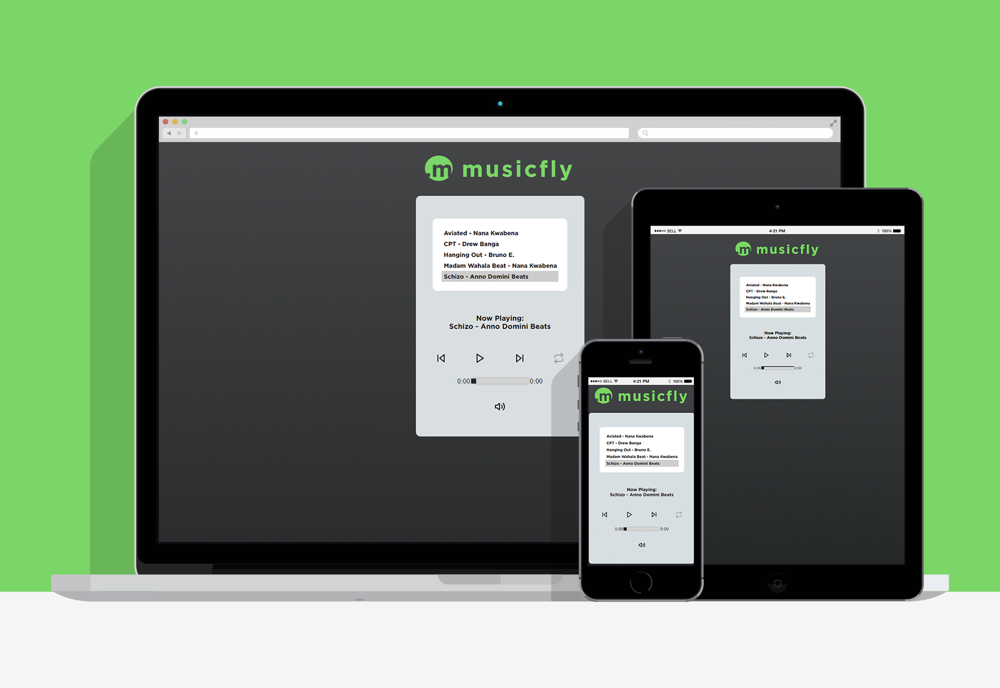

# | Music Player by Guilherme Ferreira
## Project created for the ProgramadorBR's WebDev FullStack course.
### Project/Challange proposal: To create a media player fully functional with HTML, CSS and JS. 
### Disclaimer: All musics in this project are free to use, from Youtube Audio Library

  

# | Screenshots

 

# | Live View
- [Live Site Link](https://guilhermerera.github.io/audioplayer/)

 

# | What I learned
How to access HTML elements via JS and give them actions and styles. How to integrate JS functions, conditionals, loops and etc so that each button performs its action correctly without interfering or hindering the function of another button. I'm pretty proud of my JS on this project, but I'm sure I can improve the code. All feedback is welcome.

 

# | Built With
     

 

# | Find Me
  