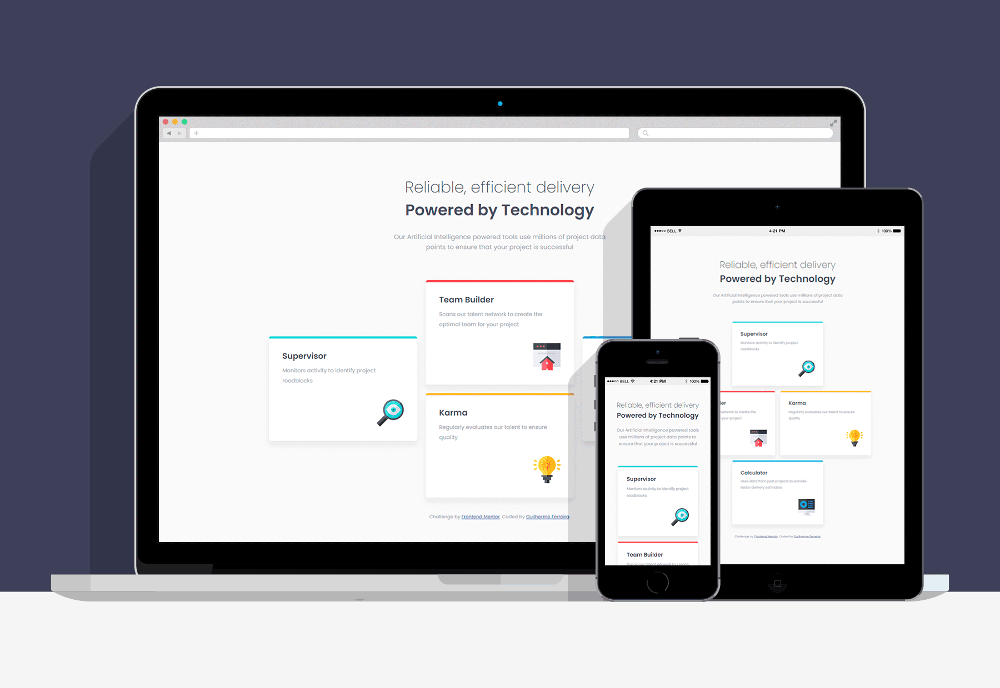

# ✔️ Frontend Mentor - Four card feature section
## This is a solution to the [Four card feature section challenge on Frontend Mentor](https://www.frontendmentor.io/challenges/four-card-feature-section-weK1eFYK).
### Project/Challange proposal: Users should be able to view the optimal layout for the site depending on their device's screen size

  

# 💻 Screenshots

 

# 🔎 Live View
- [Live Site Link](https://guilhermerera.github.io/four-card-feature-section-master/)
- [FrontEnd Mentor Solution](https://www.frontendmentor.io/solutions/4-card-feature-section-using-flexbox-E32E2XOSe)

 

# 📖 What I learned
How to flexbox for 3 diferent screen sizes while preserving the page flow when you resize the viewport and scroll through the page. I also manage to keep my CSS much more organized and with reusable classes.

 

# ⚒️ Built With
    

 

# ✉️ Message Me
  